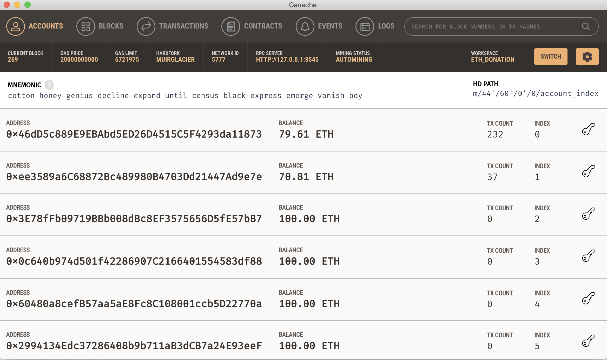
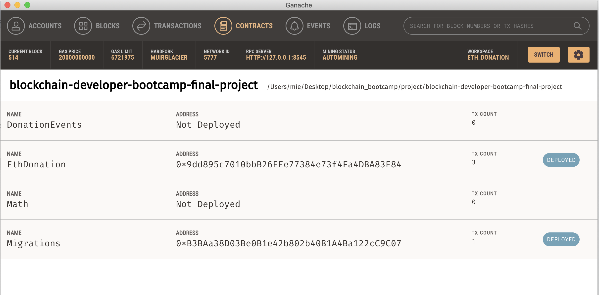

# Decentralized Charity Funding
The Decentralized Charity Funding project brings a transparency, trackable charity funding and expense management system on the Ethereum Blockchain.

## Demo Site Preview
https://pengyang-zhou.github.io/ethdonation/

## Public ETH Address for Certification
`0x7D29883c93fE4275497dF5CCBe448829f028C13E`

## Project Summary

### Uses cases
1. As a founder, I can publish a charity funding project with project descriptions and project end time.
2. As a project founder, I can manage project with adding expense details to its expense list.
3. As a project founder, I am able to get the approved expense allocation transferred to my account.
4. As a donator, I can see the list of charity funding projects.
5. As a donator, I can fund or donate ETH to a charity funding project.
6. As a donator, I can approve expenses under the project expense list.
7. As a user, I am able to get my left donated amount (if there is any) refunded if project is ended.

## Get Started

### Prerequisites
- Node.js >= v14.18.1
- Truffle
- Ganache
- npm >= 8.1.0
- vue-cli (if running front-end locally)
  - `npm install -g @vue/cli`

### Project Direcotries
- `client/ethdonation`: front-end that interacts with smart contracts.
- `contracts`: smart contracts definitions `EthDonantion.sol` and `DoonationEvents.sol`.
- `migrations`: smart contracts migration files.
- `test`: test for smart contracts
- `truffle-config.js`: truffle configurations.

    Note: In `truffle-config.js`, the contract build directory is set to `contracts_build_directory: "./client/ethdonation/src/api",`, this allows the frontend js file read contract ABI from compiled contract json file.

### Contracts

#### Compile
1. Have ganache run local blockchain (In this project, development network is set to HTTP://127.0.0.1:8545). In {root}/truffle-config.js 
   ```
    development: {
        host: "127.0.0.1",     // Localhost (default: none)
        port: 8545,            // Standard Ethereum port (default: none)
        network_id: "*",       // Any network (default: none)
    },
   ```
   **Local Ganache testnet**

    

2. `truffle console --network development` and `compile`.
   
   **compile result:**
   ```
   ...
   > Compiled successfully using:
   - solc: 0.8.9+commit.e5eed63a.Emscripten.clang
   ```

#### Test
1. `truffle console --network development` and then `test`
   
   Test output:
    ```
    truffle(development)> test
    Using network 'development'.

    Compiling your contracts...
    ===========================
    > Everything is up to date, there is nothing to compile.


    Contract: EthDonation test
        ✓ should owned by owner (54ms)
        ✓ should create an project and update project count (358ms)
        ✓ should create an expense for an existing project (386ms)
        ✓ should fail creating an expense for an non-existing project (539ms)
        ✓ should update donations after another account donated (391ms)
        ✓ should update amount allocation after expense approved and allocated (630ms)
        ✓ should update amount allocation after expense approved but state is pending since approved amount is not reached to allocation (665ms)
    ```

### Front End

To build and run front end locally with a local deployed contract.
1. Deploy contract to a local testnet
   ```
   truffle console --network development
   ```
   and in truffle console,
   ```
   migate
   ```
2. Get the contract deployed `EthDonation` contract address from Ganache or truffle console.
   

3. Update local contract address in front end code.
   In `{root}/client/ethdonation/src/api/contract.ts`, change the contract address to local deployed address.
   ```
   const contract = new web3.eth.Contract(EthDonation.abi, '{replace_me_with_local_contract_address}');

   ```
4. Build and start server
   ```
   npm install
   npm run serve
   ```
5. Load from http://localhost:8080/ and connect MetaMask to local testnet (http://127.0.0.1:8545)

## Screenshots for workflows

Checkout [here](./workflows.md) for a workthrough of the front-end interacting with smart contracts. 

## Upgrade consideration
1. Third part escrow could be applied.
2. Upgradable Contract design pattern could be applied to allow contract upgrade without deploying to a new address.
   
