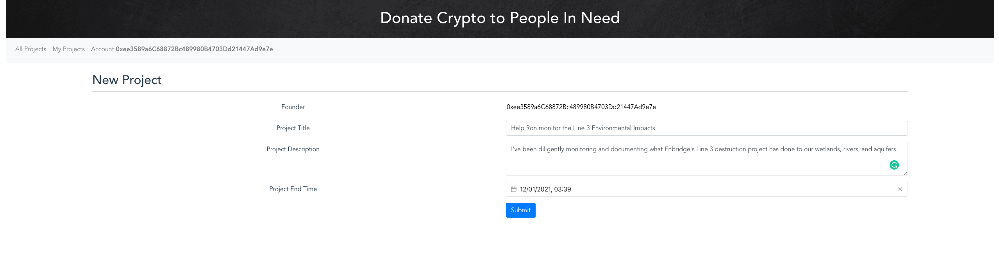
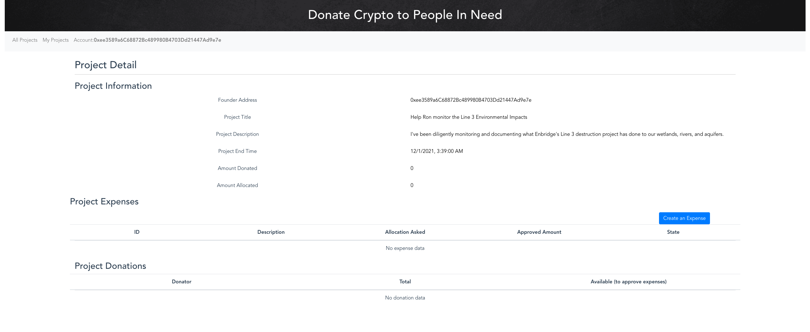
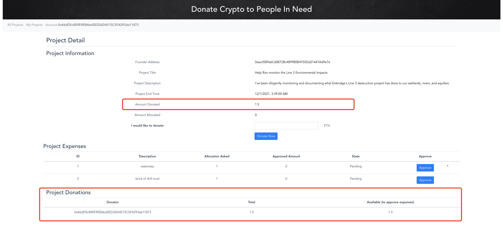
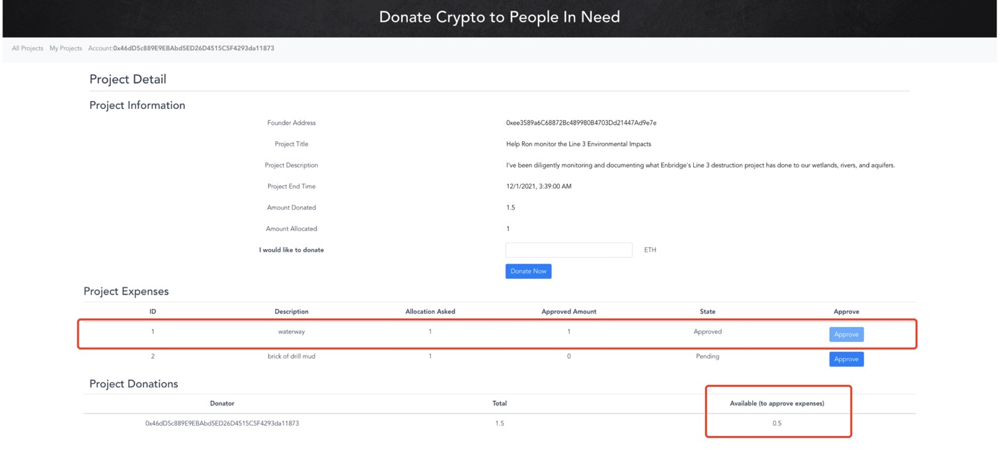
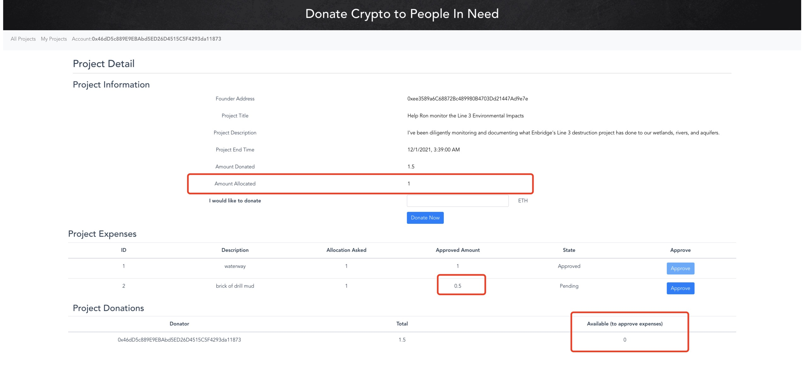

## Charity Funding (EthDonation) Workflows 

**1. A founder creates a project. The project detail reflects the project created**
   
   

**2. A project founder adds an expense. The project detail reflects and expenses detail**
   

**3. A donator donates some funds to a project. The project detail reflects the amount donated and donations list**
   

**4. A donator approves an expense. The project reflects the expense state and funded and allocated amounts of the project. The donation list also reflects the donators donations with total donations and available amount**
   

**5. A donator approves another expense, but the available amount is not reached the expense allocation asked. The expense will still be in pending state, and the amount changes are reflects**
   